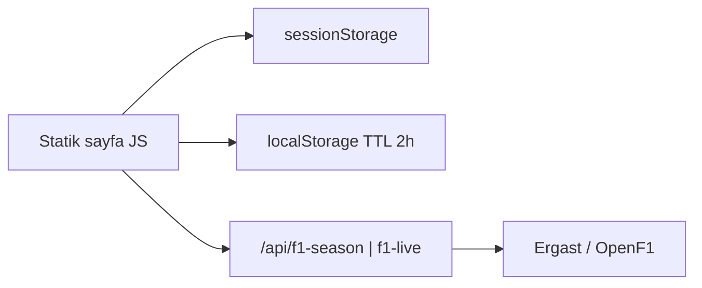

# Üç paralel özellik + çapraz kesen çalışma özeti

**Kaynak:** Bu dosya, depodaki **mevcut** dosya ve davranışlara dayanır (Mayıs 2026 çalışma kopyası). Eski taslaklar veya `docs/SEASON_TRACKER_AND_ANTHOLOGY.md` içindeki bazı ifadeler güncel kodla **uyuşmayabilir** — burada kod önceliklidir.

**Son commit’ler (referans):** `219aafe` (F1 proxy + Season Tracker), `067e341` (CSP + kopya build). Çoğu değişiklik henüz commit edilmemiş olabilir (`git status`).

---

## Genel bakış

| İz | Kullanıcı etiketi | Durum |
|----|-------------------|--------|
| **1** | Season Tracker | **Üretim kalitesinde:** canlı veri, Simple/Nerd modu, paneller, önbellek, build/dev/Vercel entegrasyonu. |
| **2** | Radio Anthology | **Çalışan bağımsız sayfa:** filtreler, kart ızgarası, detay modalı; veri gömülü JS; gerçek ses dosyası yok. |
| **3** | Circuit Atlas (`tracks/`) | **Çalışan bağımsız sayfa:** hash routing, 8 pistin editoryal profili; yarış geçmişi API ile lazy; 25 SVG varlığının çoğu henüz katalogda değil. |

**Ana React uygulaması (SPA):** Anthology ana sayfa, Timeline, News, hikâye modalı — lazy route’lar; yeni statik alt siteler SPA **dışında** tam sayfa geçişi (`<a href="...">`).

**Build zinciri:** `vite build` → `scripts/copy-season-tracker.mjs` (season-tracker + radio-anthology) → `scripts/copy-tracks.mjs` → `dist/` altında üç alt site + `public/` (circuits, fonts).

---

## CHANGE 1 — Season Tracker

### Ne gönderildi

- **Sezon özeti:** sıradaki yarış pill’i, geri sayım, şampiyona lideri, Top 3, istatistikler.
- **Live Timing:** OpenF1 üzerinden canlı oturum tespiti; canlıyken timing tower (`tower--live`), ~5s polling, hata backoff ve devre kesici (`LIVE_CIRCUIT_FAIL_THRESHOLD` / `LIVE_CIRCUIT_PAUSE_MS`).
- **Takvim rayı** + **yarış modalı** (pist görseli, sonuç özeti).
- **Geçmiş sezon sekmeleri** + **Season Snapshot** (lastik / galibiyet / en yakın bitiş vb.).
- **Simple ↔ Nerd modu:** üst çubukta toggle; Nerd’de ekstra hero istatistikleri ve üç büyük panel.
- **Tipografi:** Google Fonts CDN yok; `/fonts/st/` self-host (`npm run fonts:season-tracker`).

### Simple / Nerd modu

| Öğe | Değer |
|-----|--------|
| `localStorage` anahtarı | `f1_tracker_mode` → `'simple'` \| `'nerd'` |
| FOUC önleme | `season-tracker/index.html` içinde inline script: Nerd ise `body.is-nerd` |
| CSS | `body.is-nerd`, `.nerd-only`, `body.is-mode-animating` geçişleri |
| Nerd panelleri | Pit stop görselleştirici (`#nerdPitMount`), Head-to-head (`#nerdH2h`), Şampiyona simülatörü (`#nerdSimMount`), stint modal (`#stintModal`) |
| Lazy init | `ensureNerdPanels()` — ilk Nerd aktivasyonunda bir kez kablolanır |

Simple modda canlı kulede takım adı, pit/DRS/sektör detayları ve bazı timing alanları gizlenir; Nerd modda tam gösterim.

### API uçları (istemci)

| Proxy | Upstream | Kullanım |
|-------|----------|----------|
| `GET /api/f1-season?path=...` | Jolpica Ergast (`api.jolpi.ca`) | Sezon, sıralama, takvim, yarış sonuçları |
| `GET /api/f1-live?path=...` | OpenF1 | `sessions`, `drivers`, `position`, `stints`, `pit`, vb. |

İstemci `fetchErgastJson` / `fetchLiveJson`; OpenF1 yolları `OPENF1_ALLOWED_PATHS` ile kısıtlı.

### Önbellek ve depolama anahtarları

| Katman | Anahtar / sabit | Davranış |
|--------|-----------------|----------|
| Sürüm | `CACHE_VERSION = 'v2'` | Uyumsuz `sessionStorage` yüklerini ayırır |
| Oturum | `sessionStorage`: `f1_season_v2_{year}_{suffix}`, `f1_openf1_v2_{year}_race_sessions`, `f1_season_v2_{year}_round_{round}_{suffix}` | Sekme içi hızlı tekrar okuma |
| Kalıcı | `localStorage`: `f1_season_local_{fullKey}` → `{ t, d }` | **TTL: 2 saat** (`SEASON_LOCAL_TTL_MS`) |
| Mod | `f1_tracker_mode` | Simple/Nerd tercihi |

`cachedSeasonJson(key, loader)` sırası:

1. `sessionStorage` varsa parse et (bozuksa sil).
2. `readSeasonLocalBundle` — taze ise `sessionStorage`’a yaz ve döndür.
3. Ağdan yükle → hem `sessionStorage` hem `writeSeasonLocalBundle`.
4. Ağ hatasında süresi dolmuş `localStorage` yedeği varsa onu kullan.

### İlgili dosyalar

| Dosya | Rol |
|-------|-----|
| `season-tracker/index.html` | İskelet, mod toggle, Nerd bölümleri |
| `season-tracker/app.js` | Tüm mantık (IIFE) |
| `season-tracker/styles.css` | Layout, tower, Nerd, modal |
| `api/f1-season.ts`, `api/f1-live.ts` | Vercel sunucusuz proxy |
| `server/dev-api-server.ts` | Yerel `:3001` API |
| `public/circuits/*.svg` | Pist sanatı (`/circuits/...`) |

---

## CHANGE 2 — Radio Anthology

### Ne gönderildi

- **Bağımsız statik site:** `radio-anthology/index.html`, `app.js`, `styles.css`.
- **Editoryal UI:** Anthology ile uyumlu topbar, hero, cam paneller, “kayıt” kart estetiği (Rec_XX, scan çizgileri).
- **Gömülü arşiv:** `RADIO_ARCHIVE` — şu an **7** an (Multi 21, Webber “unbelievable”, Vettel Brazil 2012, Kimi “leave me alone”, Hamilton “bwoah”, Sainz “smooth operator”, vb.).
- **Filtreler:** Tag `<select>`, Driver `<select>`, Era segment (`all` / `2000s` / `2010s` / `2021now`).
- **Detay modalı:** bağlam, significance, etiketler; isteğe bağlı `related_story_id` → `/story/{id}` CTA; ses alanı (çoğu girişte `audio_url` yok).

### Veri şeması (`RadioEntry`)

`id`, `year`, `round`, `gp_name`, `driver`, `team`, `constructorId`, `quote`, `context`, `significance`, `tags[]`, opsiyonel `audio_url`, `related_story_id`.

Kart kapakları: `public/circuits/` içinden deterministik SVG (`CIRCUIT_TEXTURES` + hash). Takım rengi: `TEAM_HEX` / `constructorId`.

### Entegrasyon

| Alan | Durum |
|------|--------|
| Dev | `vite.config.ts` → `VANILLA_STATIC_SITES` `/radio-anthology` |
| Prod | `vercel.json` rewrite → `/radio-anthology/index.html` |
| Build | `copy-season-tracker.mjs` ile `dist/radio-anthology/` |
| Nav | `NavBar.tsx` → `/radio-anthology` |

### Eksikler (bu iz özelinde)

- Gerçek **ses URL’leri** yok; modal “No clip URL configured”.
- Veri harici JSON/CMS değil — yeni an eklemek `app.js` düzenlemesi gerektirir.
- Arşiv hikâye bağlantısı yalnızca tanımlı `related_story_id` olan girişlerde (ör. Hamilton → `hamilton-silverstone`).

---

## CHANGE 3 — Tracks / Circuit Atlas

### Ne gönderildi

- **Bağımsız statik site:** `tracks/index.html`, `app.js`, `styles.css`.
- **Hash routing:** tek `index.html`; detay `/#monaco`, `/#spa` vb. (`hashchange` + `parseHash()`). Geçersiz hash → liste görünümüne `replaceState`.
- **8 pist** gömülü `CIRCUITS[]`: Monaco, Spa, Monza, Silverstone, Suzuka, Interlagos, Bahrain, Jeddah — her biri için editoryal metin, DNA etiketleri, ikonik an, sektör profili, zorluk/DRS.
- **Liste:** karakter etiketi filtre çipleri + kart ızgarası.
- **Detay:** hero, Circuit DNA paneli, pull quote’lar, yarış geçmişi tablosu (2021 → güncel yıl).
- **Lazy geçmiş:** `#sectionHistory` `IntersectionObserver` (~120px margin) → yıllık satırlar; `fetchYearAggregate` → `/api/f1-season`.
- **Önbellek:** `sessionStorage` anahtarı `anthologyTracksRace_{circuitId}_{year}` (TTL yok — sekme ömrü).

### Pist görselleri

`attachCircuitImage` — Season Tracker ile aynı mantık: `buildCircuitBasenames`, `CIRCUIT_ASSET_ALIASES` (ör. `las_vegas` → `vegas`), `/circuits/{basename}.svg` adayları, `_placeholder.svg` yedek.

### Entegrasyon

| Alan | Durum |
|------|--------|
| Dev | Vite plugin `/tracks` |
| Prod | `vercel.json`: `/tracks`, `/tracks/`, `/tracks/:path*` → `tracks/index.html` |
| Build | `scripts/copy-tracks.mjs` → `dist/tracks/` |
| Nav | `NavBar.tsx` → “Circuit Atlas” `/tracks` |

### Kapsam notu

`public/circuits/` altında **25** SVG (+ placeholder) var; katalogda yalnızca **8** pist. Kalan pistler Season Tracker modal/takviminde kullanılabilir, Circuit Atlas’ta henüz yok.

---

## Çapraz kesen (nav, build, Vercel, fontlar, a11y)

### Navigasyon (`components/ui/NavBar.tsx`)

Menüde SPA route’ları (`/`, `/timeline`, `/news`) + tam sayfa linkler:

- `/season-tracker` — Season Tracker  
- `/tracks` — Circuit Atlas  
- `/radio-anthology` — Radio Anthology  

### Vite geliştirme (`vite.config.ts`)

`vanillaStaticSitesDevPlugin`: `season-tracker`, `radio-anthology`, `tracks` prefix’lerinde klasörden statik servis; dizin kaçışı `403`; `/prefix` → `/prefix/` yönlendirmesi. `/api` → `127.0.0.1:3001`.

### Vercel (`vercel.json`)

- Rewrites: üç alt site + SPA (`/news`, `/timeline` → `/`) + catch-all `/`.
- `api/f1-live.ts`, `api/f1-season.ts` — `maxDuration: 10`.
- CSP: self-host fontlar + Wikimedia (Season Tracker takım logoları); Google Fonts production CSP’de hâlâ `style-src`/`font-src` içinde listelenmiş olabilir — statik siteler CDN kullanmıyor.

### Build (`package.json`)

```
build / build:vercel:
  images (opsiyonel tolerans)
  → fonts:season-tracker (|| nop)
  → vite build
  → copy-season-tracker.mjs  (season-tracker + radio-anthology)
  → copy-tracks.mjs
```

| Script | Çıktı |
|--------|--------|
| `scripts/copy-season-tracker-fonts.mjs` | `public/fonts/st/*.woff2` (Bebas, Barlow Condensed, DM Sans, IBM Plex Mono) |
| `scripts/copy-season-tracker.mjs` | `dist/season-tracker/`, `dist/radio-anthology/` |
| `scripts/copy-tracks.mjs` | `dist/tracks/` |

### Erişilebilirlik (gözlemlenen)

- Üç statik HTML: skip link, `lang="en"`, `aria-label` / `aria-live` / modal `role="dialog"`.
- Season Tracker: canlı banner `role="status"`, mod toggle `aria-pressed`.
- Radio: modal focus trap, Escape ile kapanma.
- Ana SPA: `NavBar` `aria-expanded`, route Suspense fallback metin (“Loading…”).

---

## Performans / yükleme animasyonu kaldırma

Ana React uygulamasında ağır yükleme animasyonları **kaldırıldı** (çalışma kopyası):

| Kaldırılan | Etki |
|----------|------|
| `components/ui/ChipCircuitLoader.tsx` + `chipCircuitLoader.css` | Suspense fallback artık devre animasyonu değil |
| `utils/lazyWithMinDisplay.ts` | Lazy import’larda minimum gösterim süresi yok |
| `App.tsx` | `routePageSuspenseFallback` — sade metin: “Loading…” |
| `components/ui/ImageShimmer.tsx` | Statik gradient placeholder; **CSS animasyon yok** |
| `tailwind.config.js` | `animate-grain` / `animate-shimmer` keyframe’leri kaldırıldı (grep ile doğrulandı) |
| `App.tsx` | Tam ekran film grain overlay (`site-grain`) yok |

**Hâlâ shimmer kullanan yerler (bilinçli / alt site):**

- Season Tracker: modal/logo yükleme için `.shimmer`, `.logoShimmer` (alt site içi).
- Ana SPA: `ImageShimmer` bileşeni Timeline / Archive / News / StoryModal’da — animasyonsuz.

---

## Veri mimarisi notları

### Mevcut istemci önbelleği



| Sayfa | Oturum | Kalıcı TTL | Ağ |
|-------|--------|------------|-----|
| Season Tracker | `sessionStorage` tüm `cachedSeasonJson` | Ergast için 2h `f1_season_local_*` | Her iki proxy |
| Tracks | `anthologyTracksRace_*` | Yok | Yalnızca f1-season |
| Radio | Yok | Yok | Yok (gömülü veri) |

### Orta vadeli öneri (henüz uygulanmadı)

- **Sunucu tarafı önbellek:** Ergast/OpenF1 yanıtlarını Vercel KV veya edge cache ile TTL (ör. takvim 15 dk, canlı 5 sn).
- **Cron / scheduled job:** Sezon özeti JSON’unu geceleyin üret; istemci `cachedSeasonJson` yerine `/data/season-{year}.json` okuyabilir — API kotası ve soğuk açılış gecikmesi azalır.
- **İçerik DB:** Radio ve Circuit Atlas gömülü dizileri → CMS veya repo içi JSON + build-time embed; deploy’sız içerik güncellemesi için.

---

## Bilinen eksikler / riskler

| Risk | Açıklama |
|------|----------|
| **Circuit Atlas kapsamı** | 8/25+ pist; kullanıcı tüm SVG’lerin katalogda olduğunu sanabilir. |
| **Radio ses** | Tüm girişlerde `audio_url` boş; ürün “radio” vaadi sınırlı. |
| **Canlı veri kırılganlığı** | OpenF1 / oturum eşlemesi sezona bağlı; devre kesici sonrası UI “sessiz” kalabilir. |
| **Önbellek tutarlılığı** | `CACHE_VERSION` elle bump; TTL dışı eski `localStorage` nadiren stale veri gösterebilir (ağ hatasında kasıtlı fallback). |
| **CSP / harici görseller** | Wikimedia takım logoları; engellenirse fallback UI devreye girer. |
| **Dokümantasyon drift** | `docs/SEASON_TRACKER_AND_ANTHOLOGY.md` hâlâ ChipCircuitLoader / grain anlatıyor olabilir. |
| **Commit durumu** | `radio-anthology/`, `tracks/`, `public/circuits/`, fontlar çoğunlukla **untracked** — production’a gitmeden önce commit + deploy doğrulaması gerekir. |
| **withdraw_requests/** | Repo kökünde Python aracı; F1 özellikleriyle ilgisiz; bu özetin kapsamı dışında. |

---

## Dosya listesi

### Season Tracker + API

| Dosya / klasör | Açıklama |
|-----------------|----------|
| `season-tracker/index.html` | Sayfa iskeleti |
| `season-tracker/app.js` | Uygulama mantığı |
| `season-tracker/styles.css` | Stiller |
| `api/f1-season.ts` | Ergast proxy |
| `api/f1-live.ts` | OpenF1 proxy |
| `api/proxy-helpers.ts` | Ortak sanitizasyon |
| `server/dev-api-server.ts` | Yerel API |

### Radio Anthology

| Dosya | Açıklama |
|-------|----------|
| `radio-anthology/index.html` | Kabuk |
| `radio-anthology/app.js` | Veri + filtre + modal |
| `radio-anthology/styles.css` | Stiller |

### Circuit Atlas

| Dosya | Açıklama |
|-------|----------|
| `tracks/index.html` | Kabuk + hash yorumu |
| `tracks/app.js` | Pistler + routing + geçmiş |
| `tracks/styles.css` | Stiller |

### Ortak varlıklar ve araçlar

| Dosya / klasör | Açıklama |
|-----------------|----------|
| `public/circuits/*.svg` | Pist haritaları (25 + `_placeholder.svg`) |
| `public/fonts/st/*.woff2` | Self-host fontlar |
| `scripts/copy-season-tracker.mjs` | ST + Radio → dist |
| `scripts/copy-tracks.mjs` | Tracks → dist |
| `scripts/copy-season-tracker-fonts.mjs` | @fontsource → public |
| `vite.config.ts` | Dev plugin + React build |
| `vercel.json` | Rewrites + CSP + functions |
| `package.json` | `fonts:season-tracker`, `build`, `build:vercel` |
| `components/ui/NavBar.tsx` | Üç alt site linkleri |

### Ana SPA — yükleme sadeleştirme (silinen / değişen)

| Dosya | Durum |
|-------|--------|
| `components/ui/ChipCircuitLoader.tsx` | **Silindi** |
| `components/ui/chipCircuitLoader.css` | **Silindi** |
| `utils/lazyWithMinDisplay.ts` | **Silindi** |
| `App.tsx` | Minimal Suspense fallback |
| `components/ui/ImageShimmer.tsx` | Statik placeholder |

### Referans dokümanlar (güncellenmemiş olabilir)

| Dosya | Not |
|-------|-----|
| `docs/SEASON_TRACKER_AND_ANTHOLOGY.md` | Detaylı teknik karşılaştırma; bazı UI ifadeleri eski |
| `planned-changes-mapping.md` | Planlama notları |

---

## Tek satır özet

**Season Tracker** tam özellikli canlı + Nerd deneyimi ve çift katmanlı önbellekle üretimde; **Radio Anthology** ve **Circuit Atlas** bağımsız, nav/build/Vercel’e bağlı çalışan sayfalar — Radio’da ses ve Tracks’te pist kapsamı ana borçlar; ana SPA’da ağır loader/grain kaldırıldı.
